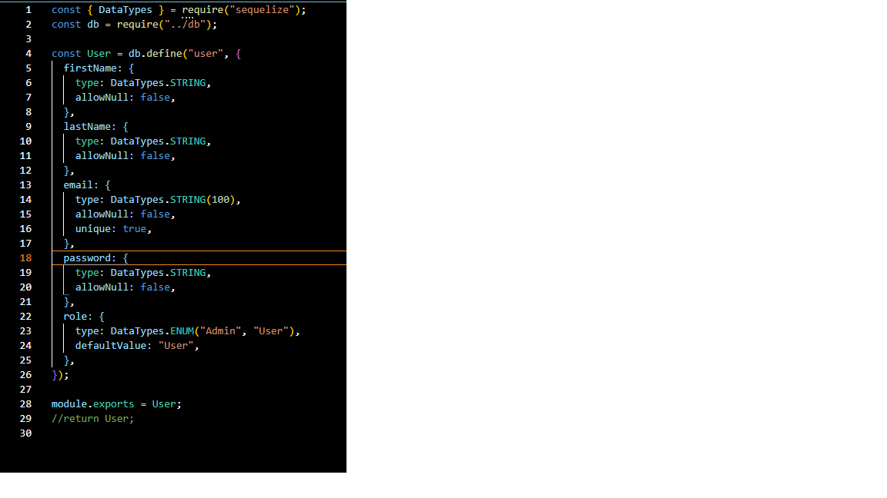

# Red Badge Final Project - For The Coilture App - Server

## Overview

This PERN project is an online community app celebrating the beauty, resilience, and diversity of natural hair in the African Diaspora. Here members can browse different hair pictures, view hair tutorials, and create their own hair tutorials for others. This app is designed for people who are in love or who are falling in love with their natural hair, whose expertise levels range from beginner to advanced. This will be a community space for all enthusiasts of the natural hair movement.

On the client side, users will be able to browse through and create hair tutorials. Users can also leave comments on the tutorials. User roles are implemented so that users can only edit/delete their own tutorials.

## Create Files

-app.js
-db.js
-.env
-gitignore

## Build modules

-user.js
-tutorial.js
-comment.js

## Build as needed

-user controller

-tutorial controller

-comments controller

##Code Example

In this example, the delete endpoint is created to create the DELETE fetch request. A conditional is created and set to the variable 'query'. The conditional statement is checking that the user's id matches the user id in the comment table OR that the user is given the role of "admin" in order to delete the comment.

## Run the server

To run the server, open the terminal and type in 'nodemon'
